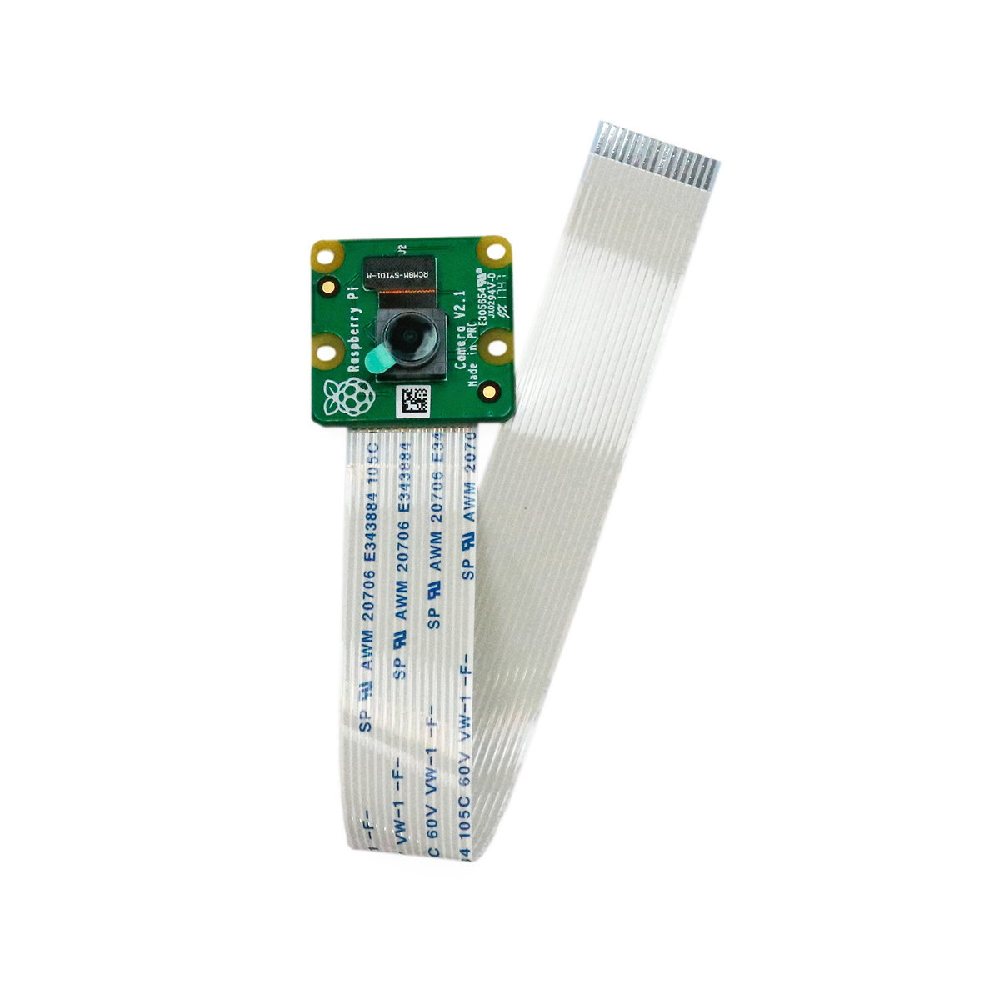

# Kamera

## Beschreibung
Das Kameramodul kann wie eine handelsübliche Webcam eingesetzt werden. Die Kamera ist speziell für den Raspberry Pi entwickelt und kann einfach über den CSI-Steckplatz (Camera Serial Interface) angeschlossen werden. Das Modul ist mit einem hochwertigen Bildsensor von Sony ausgestattet, der eine Bildauflösung bis 8 Megapixel liefert. Daneben können Videoaufnahmen erstellt werden bei 1080p mit 30fps, bei 720p mit 60fps und bei 640x480 Pixeln mit bis zu 90fps. Eine optimale Handhabung wird durch automatische Steuerfunktionen für Belichtung, Lichtstärkeerkennung und Weißabgleich sichergestellt.

Ideale Anwendungsbereiche des Moduls sind unter anderem Überwachungskameras, sowie Haus- und Wildtierbeobachtungen. Für dunklere Lichtverhältnisse empfiehlt sich die NoIR-Version der Raspberry Pi Camera V2.

Alle weiteren Hintergrundinformationen, sowie ein Beispielaufbau und alle notwendigen Programmbibliotheken findet man über alle gängigen Suchmaschinen durch die Eingabe der genauen Komponentenbezeichnungen.

<!-- infolist -->
## Wichtige Links für die ersten Schritte:

- [Raspberry Pi Projects - Picamera](https://projects.raspberrypi.org/en/projects/getting-started-with-picamera) 

## Projektbeispiele:

- [Dietle - Überwachungskamera](https://www.dietle.de/bau-einer-ueberwachungskamera-mit-raspberry-pi/)

## Weiterführende Hintergrundinformationen:

- [Raspberry Pi - Wikipedia Artikel](https://de.wikipedia.org/wiki/Raspberry_Pi) [(Camera](https://de.wikipedia.org/wiki/Raspberry_Pi) [Serial Interface)](https://de.wikipedia.org/wiki/Raspberry_Pi)

